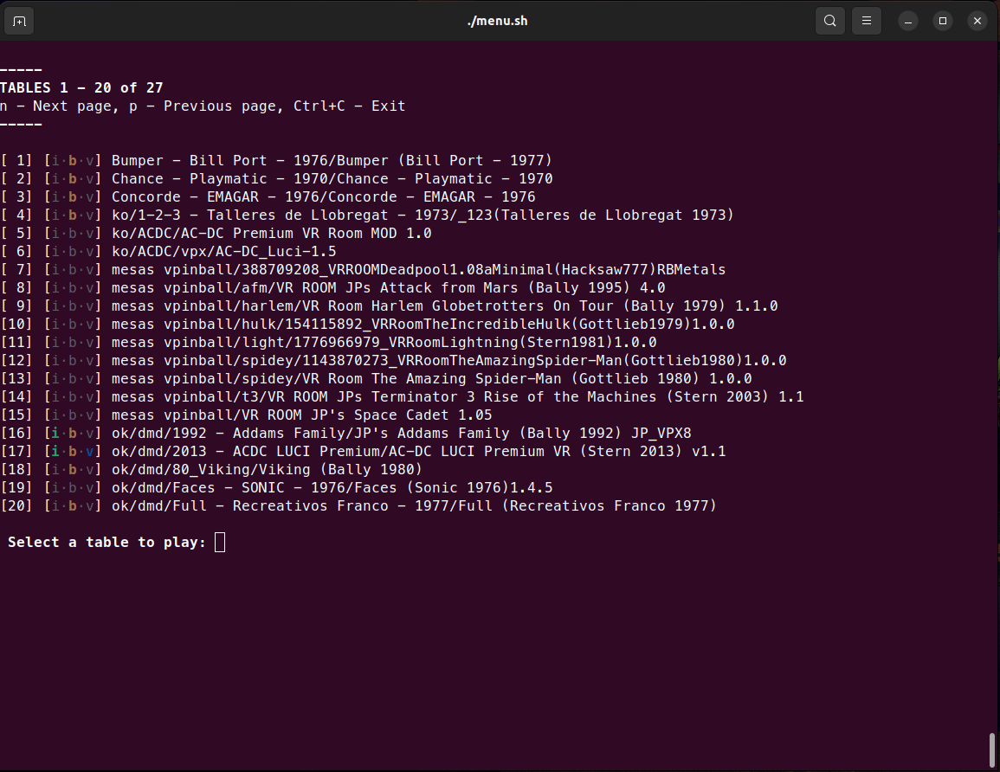
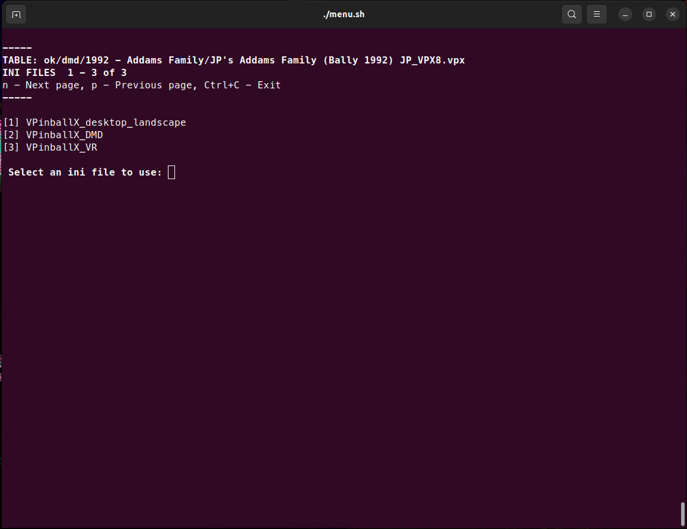

# vpinball-bash-menu
Simple bash launcher for [vpinball standalone](https://github.com/vpinball/vpinball/tree/standalone).

## Table of Contents
1. [Install](#install)
1. [Motivation](#motivation)
1. [Features](#features)
1. [Screenshots](#screenshots)
1. [Alternatives](#alternatives)
1. [Usage](#usage)
1. [Additional Resources](#additional-resources)
1. [References & Ackowledgements](#references--ackowledgements)
    - [Code Related](#code-related)

## Install
Just clone the project or download `menu.sh` script and give it execution permission with `chmod +x menu.sh`.

See [Usage section](#usage) for details on how to run it.

## Motivation
The goal of this project is providing a simple way of exploring and configuring my vpx collection.

The ideas behind it are:
* List all vpx files within a directory (and all its subdirectories) in order to quickly visualize my collection.
* List all ini files within a directory, so it is possible to launch any vpx file with different configurations. E.g. I have a setup with the table in one screen (portrait orientation) and the backglass + DMD in a separate screen, another one for a single secondary screen in portrait mode, and one more for a single screen in landscape mode).
* Logs are printed in the console to quickly test the different configurations.
* Launch tables avoiding to type once and again the same long and prone to errors command line.

## Features
* Show a list of all the vpx files found inside a customizable root path.
* Select the ini file you want to use for launching the table among those found in a customizable root path.
* Customize the number of items displayed at once on screen.
* Show information about specific `ini`, `directb2s`, and `vbs` files stored in the same directory as the vpx file. A letter is shown for each one, colorized or greyed out depending on whether the file was found or not.

## Screenshots
The following screenshots shows the process of launching a table:


Table selection menu


Ini selection menu


The Addams Family table being executed with a 3 screen setup: backglass, table and logs.

## Alternatives
There are some good alternatives focused on different aspects and functionalities, I recommend you to try, at least, the following ones:

* [vpxtool](https://github.com/francisdb/vpxtool) by [francisdb](https://github.com/francisdb). A cross-platform console based utility written in Rust that provides a fancier front-end and a good set of utilities to deal with vpx files.
* [vpx](https://github.com/vpinball/vpinball/blob/standalone/standalone/scripts/vpx). Bash script provided within the vpinball standalone and provides access to a wider set of `VPinballX_GL` command line parameters.

 ## Usage
```
./menu.sh [ -t | --tables <TABLES_ROOT_DIR>] (default: $HOME/pinball/tables)
		  [ -i | --ini <INI_FILES_ROOT_DIR>] (default: $HOME/pinball/ini)
	  	  [ -e | --exe <VPINBALL_BINARY_PATH>] (default: $HOME/pinball/vpinball/build/VPinballX_GL)
		  [ -p | --page-size <NUMBER_OF_ITEMS_PER_PAGE>] (default: 20)
		  [ -h | --help ]

```
* `-t | --tables`: path to our collection of vpx files. It may contain sub-directories. Defaults to `${HOME}/pinball/tables`.
* `-i | --ini`: path to the directory containing our ini files. It may contain sub-directories. Defaults to `${HOME}/pinball/ini`.
* `-e | --exe`: path to the vpinball standalone binary file. Defaults to `${HOME}/pinball/vpinball/build/VPinballX_GL`.
* `-p | --page-size`: number of items per page. Defaults to `20`.
* `-h | --help`: display usage text.

To change default values, just edit the bash script variables defined at the beginning.

## Additional Resources
* [vpx standalone scripts](https://github.com/jsm174/vpx-standalone-scripts). A set of table patches for VPX standalone.

## References & Ackowledgements
* [vpinball standalone](https://github.com/vpinball/vpinball/tree/standalone)

### Code Related
* [https://askubuntu.com/questions/682095/create-bash-menu-based-on-file-list-map-files-to-numbers](https://askubuntu.com/questions/682095/create-bash-menu-based-on-file-list-map-files-to-numbers)
